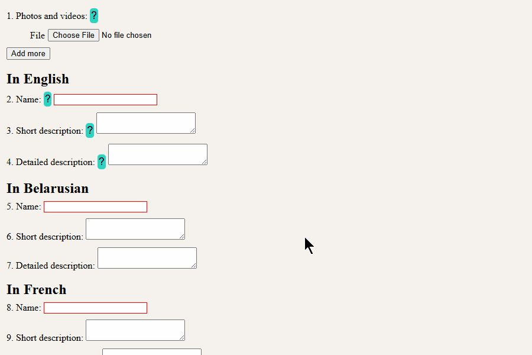

# 🧠 UI components

A set of small UI components

---

## 1. Tooltip

Tooltip is a lightweight vanilla JavaScript library that automatically creates tooltip buttons and displays contextual help without requiring any dependencies. It supports custom button templates, custom content markup, and multiple tooltips on the same page.

---
