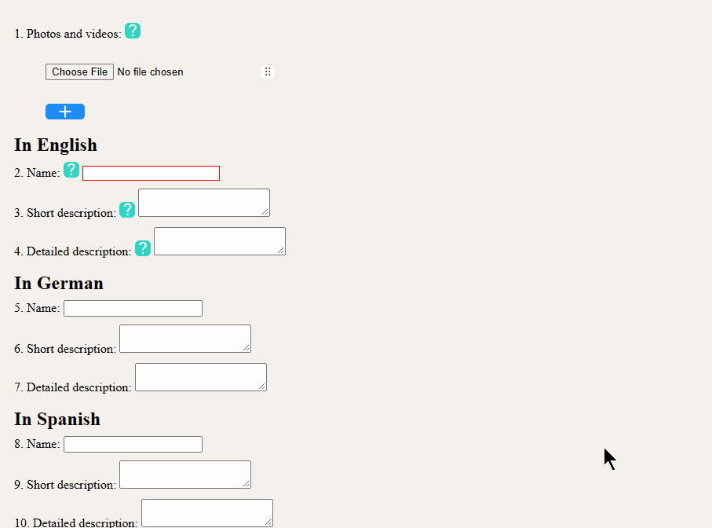

# 🧠 File Selector

A library that extends the functionality for adding files to file inputs. It allows for reordering files and handles extension validation as well as thumbnail generation.



---

## 📦 Installation

Include the stylesheet and script on your page.

```html
<link rel="stylesheet" href="attaching-files.css">

<script src="attaching-files.js"></script>
```

---

## 🛠 Quick Start

Initialize all file selectors after the document has loaded.

```javascript
document.addEventListener('DOMContentLoaded', () => {
	document
	.querySelectorAll('.file-selector')
	.forEach(fileSelector => {
		new FileSelector(fileSelector);
	});
});
```

---

## ⚠ Requirements

Every file-selector element must be located inside the form with enctype="multipart/form-data".

---

## 📋 Generated Form Fields

Files are sent to the server with names file_1, thumbnail_1, file_2, thumbnail_2 etc.
If a thumbnail is not required for a file, the corresponding thumbnail is not sent and it's input is not displayed.

---

## 📚 Public API

File Selector instance exposes only `element`.

---

## 📝 Constructor Options

Constructor accepts an options object. A complete configuration example:

```javascript
document.addEventListener('DOMContentLoaded', () => {
	document
	.querySelectorAll('.file-selector')
	.forEach(fileSelector => {
		const options = {
			rowsLimit: 5												,
			thumbnailLabel: 'Mini'										,
			fileAccept: '.jpg, .jpeg, .png, .webp, .avif, .mp4, .webm'	,
			filesRequiringThumbnail: '.mp4, .webm'						,
			thumbnailAccept: '.jpg, .webp, .avif'						,
			extraCheck													,
			extraCheckIsThumbnailRequired								,
			firstFileAccept: '.jpg, .webp, .avif'
		};
		
		new FileSelector(fileSelector, options);
	});
});
```

---

## 📋 Available Options

| Option 						| Type 		| Default 		| Description 												|
|-------------------------------|-----------|---------------|-----------------------------------------------------------|
| rowsLimit 					| number 	| 1 			| Maximum number of files to add. 							|
| thumbnailLabel 				| string 	| `Thumbnail` 	| Thumbnail input title. 									|
| fileAccept 					| string 	| `` 			| Accept attribute value. 									|
| filesRequiringThumbnail 		| string 	| `` 			| Files requiring a thumbnail. 								|
| thumbnailAccept 				| string 	| `` 			| Accept attribute value for thumbnail. 					|
| firstFileAccept 				| string 	| `` 			| Accept attribute value for the first file. 				|
| firstFilesRequiringThumbnail 	| string 	| `` 			| First file requiring a thumbnail. 						|
| firstThumbnailAccept 			| string 	| `` 			| Accept attribute value for the first file's thumbnail. 	|
| extraCheck 					| function 	| `null` 		| Custom additional validation callback. 					|
| extraCheckIsThumbnailRequired | function 	| `null` 		| Custom additional validation callback. 					|
| scrollAreaWidth 				| number 	| `50` 			| Horizontal auto-scroll activation area. 					|
| scrollAreaHeight 				| number 	| `50` 			| Vertical auto-scroll activation area. 					|
| scrollSpeedWidth 				| number 	| `20` 			| Horizontal auto-scroll speed. 							|
| scrollSpeedHeight 			| number 	| `20` 			| Vertical auto-scroll speed. 								|

- An empty string for `...accept` means that any files are allowed.
- An empty string for `...requiringThumbnail` means that a thumbnail is not needed.
- Syntax for writing a string for `...accept` and `...requiringThumbnail` is the same as for `accept` html attribute (".txt, .png", "image/jpeg", "video/*").

---

## 🔌 Callbacks

extraCheck and extraCheckIsThumbnailRequired - custom callbacks wich are called when changes occur.
The library performs checks based solely on file extensions. Custom callbacks, however, can additionally verify file contents. For example, to check whether an image is static.
extraCheck determines whether the error will be highlighted. It must return `true` if there is no error, and `false` if there is one.
extraCheckIsThumbnailRequired determines whether a thumbnail is needed for this file. It must return `true` if is needed, and `false` otherwise.
Both functions accept input as a parameter.

---
